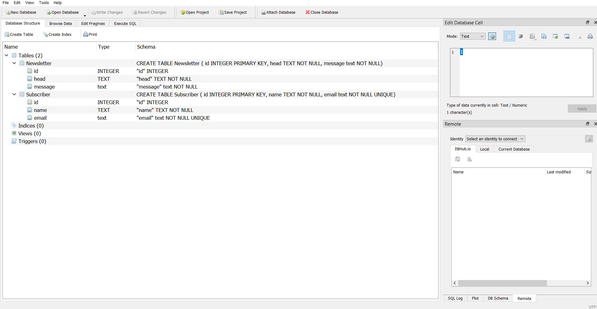

## ✔ CureLink Backend Intern Assignment : Newsletter Service
- This is an application regarding newsletter service for any health based management system

****

### REQUIREMENTS : 
- python 3
- schedule
- time
- smtplib
- MIMEMultipart from email.mime.multipart
- MIMEText from email.mime.text

****

### How this Script works :
- User just need to download the file.
- User will be able to see the two .py files, database_creation_and_data_insertion.py and news_letter.py.
- First user need to run the database_creation_and_data_insertion.py file inorder to create the database and tables into it.
- The database will be created in the same folder where the .py code is present.
- After the database and tables are created successfully, user will be able to the message for the same in the console.
- Now after, user has run the database_creation_and_data_insertion.py file, he/she needs to run the new_letter.py file inorder to sent the email to the list of subscriber
- But before that, user need to enter the email ID and password of the user, so that will work as the sender email ID.
- After the email send to the subscriber successfully, user will be able to the message for the same in the console.

### Purpose :
- This scripts helps user to easily get the basic knowledge health and wellness management system sends mail preriodically to their subscriber regarding their health and fitness.

****

### SCREENSHOTS :

   
   
   
   
   
   
   
   

### Name:
- Akash Ramanand Rajak

